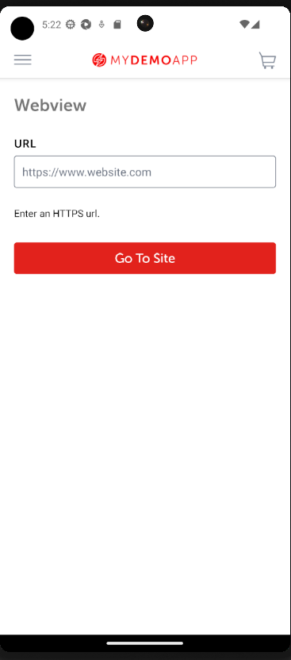

# 14.appium-getting-started
appium for mobile application testing

## Tools installed and configured at the workshop
#### Install Android Developer Studio
#### Set ANDROID_HOME env variable
ex
``` bash
    C:\Users\Maria\AppData\Local\Android\Sdk
``` 

#### Set in Path global env variable path of platform-tools

``` bash
    C:\Users\Maria\AppData\Local\Android\Sdk\platform-tools
``` 

#### Create in Virtual Device Manager a new device and set it up with Android 13

https://developer.android.com/studio/run/managing-avds

#### Option 1 (old legacy way)
##### For running appium 1.x you need Appium Server GUI
https://github.com/appium/appium-desktop/releases/download/v1.22.3-4/Appium-Server-GUI-windows-1.22.3-4.exe
##### 
Set address and port 4445 and start it by clicking start server

#### Option 2 (new way)
##### For running appium 2.x you need Appium install with node npm
##### Install node
https://nodejs.org/en/download

##### Install appium
``` bash
    npm install appium@next
 ```
##### appium driver install uiautomator2
``` bash
    appium driver install uiautomator2
``` 
##### start appium 

```bash
  appium --address 127.0.0.1 --port 4445
```
#### get demo app

https://github.com/saucelabs/my-demo-app-rn/releases
https://github.com/saucelabs/my-demo-app-rn/releases/download/v1.3.0/Android-MyDemoAppRN.1.3.0.build-244.apk
Rename it locally to SauceLabDemo.apk and put it in path that needs to be updated in FrameworkConfiguration
```bash
desiredCapabilities.setCapability(MobileCapabilityType.APP, "C:\\Users\\Maria\\apks\\SauceLabDemo.apk");
```
#### set the chrome driver executable in FrameworkConfiguration

```bash
desiredCapabilities.setCapability(UiAutomator2Options.CHROMEDRIVER_EXECUTABLE_OPTION, "C:\\Users\\Maria\\chromedrivers\\chromedriver103.exe");
```
#### start adb 
```bash
  adb devices -l
```


#### start android simulator 


#### check device/virtual device is present and it does not show unauthorized


## 0. Setup
### 0.1. Clone project 
### 0.2. Make your own branch from develop using IntelliJ. Name it  feature/firstname-lastname.
### 0.3. Copy the code from starter in your module

## 1. Review
- FrameworkConfiguration on how the AndroidDriver was started
- CucumberHooks to see how app is reset between scenarios
- SauceLabsNativeSteps

## 2. Implement the steps to perform login in native app

```gherkin
    When User logs in with username "<username>" and password "<password>" on the native login screen
    Then User will not see login screen
```


## 3. Implement the steps to load the webview of the https://www.saucedemo.com by loading the url from the mobile app menu


```gherkin
    When User selects Webview from native menu
    Then Webview selection is displayed
    When User enters "https://www.saucedemo.com" in webview selection and clicks enter
```




## 4. Implement the steps to login in the webview  https://www.saucedemo.com
```gherkin
  When User logs in with username "<username>" and password "<password>" on the webview login screen
```


